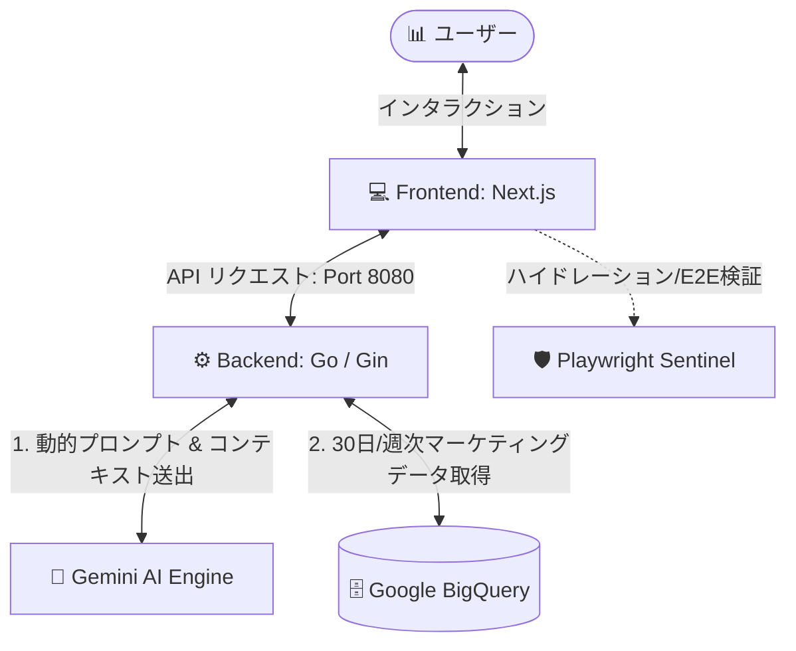

# 🌌 Decision Tracer: Marketing Analytics Dashboard

Decision Tracer は、**Next.js App Router (React 19)** と **Go (Gin-Gonic)**、そして **Gemini AI** と **Google BigQuery** を融合させた、超モダンでインテリジェントなマーケティング意思決定追跡 & ROI 分析ダッシュボードです。

ユーザーが自然言語でマーケティングデータについて質問すると、AI が接続先の BigQuery スキーマを元に**その場ですぐに実行可能な SQL** を動的に生成し、さらにフロントエンドと同期して**美しい Recharts グラフを完全自動生成**する、次世代の分析体験を提供します。

---

## 🛠️ システムアーキテクチャ (System Architecture)



---

## 🚀 必須環境 (Prerequisites)

ローカル環境構築を開始する前に、以下のツールがインストールされていることを確認してください。

- **Node.js**: `v20.x` 以上推奨
- **Go**: `v1.21.x` 以上推奨
- **Git**

---

## 📦 クイックスタート: 環境構築手順

リポジトリをクローン後、フロントエンドとバックエンドのそれぞれのディレクトリで設定を行います。

### 1. ⚙️ バックエンドのセットアップ (Go)

バックエンドは、データプロバイダー（BigQuery 連携）と AI 分析エンジン（Gemini API 連携）の役割を担います。

```bash
# バックエンドディレクトリへ移動
cd backend

# Go 依存モジュールのダウンロード
go mod download
```

#### 環境変数の設定

`backend` 内で以下の環境変数を設定します。ターミナルでエクスポートするか、ローカル起動時にプレフィックスとして渡します。

| 環境変数名                       | 必須     | 説明                                                                          | 例                          |
| :------------------------------- | :------- | :---------------------------------------------------------------------------- | :-------------------------- |
| `GEMINI_API_KEY`                 | **必須** | Gemini API にアクセスするための有効な API キー                                | `AIzaSyBmd...`              |
| `PORT`                           | 任意     | バックエンドの起動ポート（デフォルト: `8080`）                                | `8080`                      |
| `GOOGLE_APPLICATION_CREDENTIALS` | 任意     | GCP (BigQuery) 認証用 JSON の絶対パス。未設定時はモックデータが返却されます。 | `/path/to/credentials.json` |

---

### 2. 💻 フロントエンドのセットアップ (Next.js)

フロントエンドは、プレミアムなダークモードテーマ、ダイナミックアニメーション、およびインテリジェントな Recharts データマッピングを備えています。

```bash
# フロントエンドディレクトリへ移動
cd ../frontend

# パッケージのインストール
npm install
```

#### 環境変数の設定

`frontend` ディレクトリのルートに `.env.local` ファイルを作成し、以下を記述します。

```env
# バックエンド API サーバーのベース URL
NEXT_PUBLIC_API_URL=http://localhost:8080
```

---

## 🏃‍♂️ アプリケーションの起動方法

環境構築が完了したら、バックエンドとフロントエンドを起動します。

### 1. バックエンドサーバーの起動 (Port: 8080)

`backend` ディレクトリで以下を実行します。

```bash
cd backend
GEMINI_API_KEY="あなたのAPIキー" go run cmd/main.go
```

> **Note**: Windows (PowerShell) の場合は以下のように起動します：
> `$env:GEMINI_API_KEY="あなたのAPIキー"; go run cmd/main.go`

### 2. フロントエンド開発サーバーの起動 (Port: 3000)

別のターミナルを開き、`frontend` ディレクトリで以下を実行します。

```bash
cd frontend
npm run dev
```

ブラウザで [http://localhost:3000](http://localhost:3000) にアクセスすると、美しいダッシュボードが表示されます！

---

## 🧪 テストと品質監査の実行

本プロジェクトは、頑健なテスト駆動設計と厳格な品質検査フックを採用しています。

### 1. ユニットテスト (Vitest)

フロントエンドの共通コンテキスト、型安全なマッピング、およびロジックのテストです。

```bash
cd frontend
npm run test
```

### 2. E2E ハイドレーション監視テスト (Playwright)

ブラウザのコンソール警告を監視し、SSR (Server-Side Rendering) 時のハイドレーションエラーを 100% 根絶するための Sentinel テストです。

```bash
cd frontend
npx playwright test
```

### 3. プロジェクト品質監査ゲートキーパーの実行 (Gatekeeper)

Git コミット前に、Go ビルド、フロントエンド型チェック、ESLint、Vitest、および Playwright テストをワンストップで検証する監査スクリプトです。

```bash
# プロジェクトのルートディレクトリで実行
bash ./.antigravity/gatekeeper.sh
```

---
